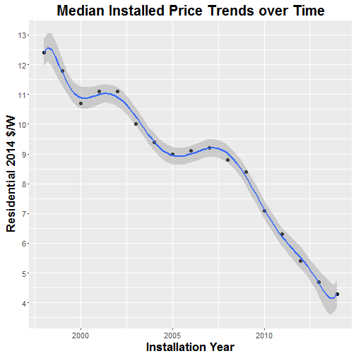

## Regression

- Almost any set of data can be perfectly fitted with some high-order complex polynomial.   
  - But what is the true benefit and at what cost?  
  
  
We will be looking at the following data. 
  - Photovoltaic System Pricing Trends: Historical, Recent, and Near-Term Projections 2015 Edition
  - Which can be found [here](https://en.openei.org/datasets/dataset/photovoltaic-system-pricing-trends-historical-recent-and-near-term-projections-2015-edition) 

--- &twocol
## Let's take a look at some Photovoltaic Pricing Trends
*** =left

*** =right
Do you see a trend?

--- &twocol
## Let's just draw a straight line.
*** =left 

*** =right
  

This gives us an R^2 of 0.94.  
That's pretty good...   
Do you think we could do any better?  

--- &twocol
## How about a second order polynomial?
*** =left 
  

*** =right 
  

This gives us an R^2 of 0.964.  
Is that better?  

--- &twocol
## How about a third order polynomial?
*** =left 
  

*** =right 

This gives us an R^2 of 0.9642.  
 

--- &twocol
## You get the idea
### 9th degree polynomial fit
*** =left

*** =right

This gives us an R^2 of 0.9744062.  
  
- It's only marginally better than the linear fit. 
  - It is better... but is it worth it? At what cost?
- How is it trending at the end?  
  - It is going up! That's actually contrary to what the latest data would suggest...

--- 
## Conclusion

- This is a very simple example that illustrates how simple might be better.  
  - Check out the [Practical Machine Learning](https://www.coursera.org/learn/practical-machine-learning) to learn about the importance of: 
    - Loss of generality of the model.
    - Overfitting
    - Training and Testing Data Sets
    - And much more!

